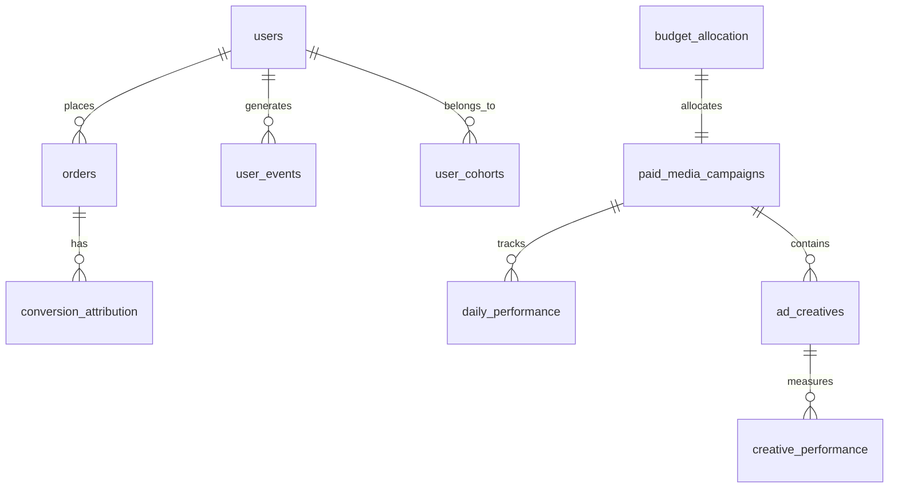

# Instruções para Criar Webapp Streamlit - Case Analista de Growth

## Objetivo
Criar uma aplicação web usando Streamlit para apresentar um case de Analista de Growth com foco em Mídia Paga. O app deve fornecer todas as informações necessárias para o candidato realizar o case de forma autônoma. O desafio principal é: **"Estratégia para aumentar LTV/CARC em 30% em 3 meses"**

## Requisitos Técnicos

### Bibliotecas Necessárias
- streamlit
- pandas
- mysql-connector-python
- plotly (para visualizações interativas)
- datetime
- numpy

### Configuração da Página
- Título: "Case Analista Growth - Bluma"
- Ícone: 💅 (emoji de esmalte)
- Layout: wide (para aproveitar toda a tela)
- Sidebar: expanded (visível por padrão)

## Estrutura do App

### 1. Header Principal
- Título grande e centralizado: "💅 Case: Analista de Growth - Mídia Paga"
- Estilo: Cor rosa (#FF1493), fonte grande (3rem)

### 2. Sidebar (Barra Lateral)
Deve conter:

#### Logo/Imagem da Empresa
- Placeholder com cores da marca ou texto "BLUMA BEAUTY"

#### Credenciais do Banco
- Mostrar em um expander
- Formato de código para fácil cópia:
  ```
  Host: 95.111.240.159
  Port: 3306
  Database: bluma_case
  Username: candidato
  Password: bluma321
  ```

#### Métricas-Alvo do Negócio
- LTV/CARC Atual: 2.33x
- Meta: 3.03x (+30%)
- Prazo: 3 meses

### 3. Conteúdo Principal - Organizado em Tabs

#### Tab 1: "📋 Contexto do Negócio"

**Layout**: 2 colunas (2:1)

**Coluna Esquerda:**
- Descrição da empresa (marketplace de beleza e bem-estar)
- Situação atual e desafios:
  - CAC aumentou 35% em 3 meses
  - Taxa de ativação caiu de 12% para 8%
  - LTV/CARC está em 2.33x (abaixo da meta histórica de 3.0x)
  - Desafio: aumentar 30% em 3 meses

**Visualizações (3 gráficos lado a lado):**
1. Gráfico de pizza: Distribuição de canais de aquisição
   - Meta Ads: 45%
   - Google Ads: 25%
   - TikTok Ads: 10%
   - Organic: 15%
   - Referral: 5%

2. Gráfico de barras: Serviços e ticket médio
   - Manicure: R$ 65 (35% share)
   - Massagem: R$ 120 (20% share)
   - Limpeza de Pele: R$ 95 (15% share)
   - Design Sobrancelhas: R$ 55 (15% share)
   - Depilação: R$ 80 (15% share)

3. Treemap: Cidades de operação
   - São Paulo: 30%
   - Rio de Janeiro: 20%
   - Belo Horizonte: 10%
   - Outras: 40%

**Coluna Direita:**
- Cards com KPIs atuais:
  - LTV/CARC: 2.33x (-23%)
  - CAC Médio: R$ 90 (+35%)
  - Taxa de Ativação: 8% (-4pp)
  - AOV: R$ 95 (+5%)
  - Retenção M1: 22% (-3pp)

#### Tab 2: "🗄️ Estrutura de Dados"

**Diagrama de Relacionamento (Mermaid):**


**Descrição das Tabelas:**
Criar cards expansíveis (expanders) organizados em 3 colunas com:
- Nome da tabela
- Descrição breve
- Lista de campos
- Quantidade aproximada de registros

Tabelas e volumes:
- users: 50,000 registros
- orders: ~150,000 registros  
- paid_media_campaigns: 120 registros
- daily_performance: ~3,600 registros
- ad_creatives: ~600 registros
- creative_performance: ~18,000 registros
- user_events: ~300,000 registros
- user_cohorts: ~4,000 registros
- budget_allocation: ~60 registros

#### Tab 3: "📊 Queries de Exemplo"

Organizar queries em categorias usando sub-tabs:

**Categorias:**
1. Análises Básicas
   - Overview geral
   - Performance por canal

2. Análise de CAC e LTV
   - CAC por canal (30 dias)
   - LTV por canal (90 dias)

3. Análise de Cohorts
   - Retenção por cohort mensal

**Formato de apresentação:**
- Título da query
- Código SQL em syntax highlighting

#### Tab 4: "🎯 Orientações"

**Missão Principal:**
Box de destaque com o objetivo: **"Desenvolver estratégia para aumentar LTV/CARC em 30% (de 2.33x para 3.03x) em 3 meses"**

**Contexto do Desafio:**
- Prazo: 3 meses para implementação
- Meta: LTV/CARC de 3.03x
- Restrição: Budget de mídia paga não pode aumentar mais de 10%

**Abordagem Sugerida:**
Lista de passos gerais (não prescritivos):
1. Explorar e entender os dados
2. Identificar problemas e oportunidades
3. Desenvolver hipóteses testáveis
4. Propor soluções baseadas em dados
5. Quantificar impacto esperado

**O que esperamos:**
- Profundidade analítica
- Pensamento estratégico
- Foco em métricas de negócio
- Recomendações acionáveis
- Clareza na comunicação

#### Tab 5: "💡 Recursos e Dicas"

**Layout em 3 colunas:**

**Coluna 1 - Conceitos:**
Expanders com explicações de:
- LTV/CARC
- CAC e Payback
- Incrementalidade
- Cohort Analysis
- Fadiga Criativa

**Coluna 2 - Ferramentas:**
Lista de ferramentas recomendadas:
- SQL: Workbench, DBeaver
- Análise: Python, R, Excel
- Visualização: Tableau, Power BI

**Coluna 3 - Dicas Rápidas:**
Box de sucesso com bullets:
- Valide os dados primeiro
- Foque no que move o negócio
- Documente suas premissas
- Pense em experimentos
- Priorize por impacto

**Critérios de Avaliação:**
Gráfico de barras horizontal mostrando pesos:
- Technical Skills: 40%
- Analytical Thinking: 30%
- Business Acumen: 20%
- Communication: 10%

### 4. Footer
Texto centralizado em cinza:
- "Case desenvolvido para avaliar habilidades de Growth Analytics | Bluma © 2024"
- "Em caso de dúvidas técnicas, entre em contato com o time de recrutamento"

## Estilização CSS

Adicionar CSS customizado para:
- `.main-header`: Título principal em rosa
- `.metric-card`: Cards de métricas com borda lateral rosa
- Aumentar fonte das tabs para melhor legibilidade

## Cores da Marca
- Principal: #FF1493 (Deep Pink)
- Secundária: #FF69B4 (Hot Pink)
- Terciária: #FFB6C1 (Light Pink)
- Fundo cards: #FFF0F5 (Lavender Blush)
- Texto: Padrão do Streamlit

## Gráficos Plotly
- Usar escala de cores 'RdPu' (Red-Purple)
- Remover gridlines desnecessárias
- Margins reduzidas para aproveitar espaço
- Hover com informações adicionais

## Funcionalidades Opcionais
- Sistema de analytics para rastrear uso
- Dark mode toggle
- Calculadora de métricas inline
- Export das queries exemplo

## Observações Importantes
1. O app deve ser self-contained (não precisa conexão real com banco)
2. Foco em fornecer informações, não em prescrever soluções
3. Design clean e profissional
4. Mobile-friendly não é prioridade (case será feito em desktop)
5. Evitar elementos que distraiam do conteúdo principal

## Nome do Arquivo
Salvar como: `case_growth_bluma.py`

## Comando para Executar
```bash
streamlit run case_growth_bluma.py
```

O app abrirá automaticamente no navegador padrão na porta 8501.